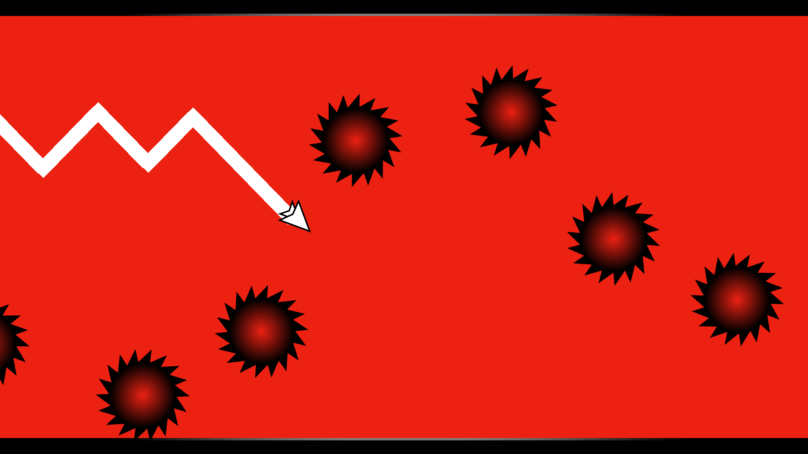
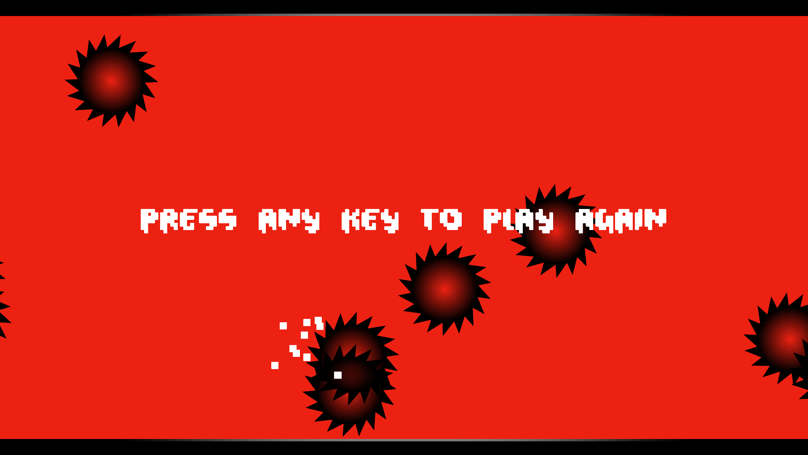

# Geometry Dash Wave
<a href="https://lenibi.github.io/Geometry-Dash-Wave-Final/">Click Here To Play</a>
#### Please allow some loading time! Project may take from 5 seconds to a minute to load. 
Works best on a PC 1080p 16:9 screen. Runs on mobile horizontally. On mobile, rotating screen orientation may break the game.

## Description

A simple clone of the wave gamemode from Geometry Dash. Quickly made this for fun in a couple hours.
The trail effect was challenging. It is made by instantiating a rhombus (or square rotated 45 degrees) at the player position over and over.
Death particle effect, spinning saws, music, replay. 

## How to play

* Hold down the mouse left click to go up, do nothing to go down
* Hit the ground, ceiling or saws and you lose  
